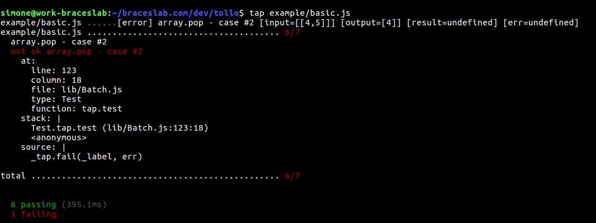

# tollo

[](https://www.npmjs.org/package/tollo)
[](https://www.npmjs.org/package/tollo)
[](http://standardjs.com/)

javascript testing library AAA schema

# This project is under development

## Purpose

Write declarative, massive, maintenable unit test  

## Install

````bash
$ npm i tollo --save
$ npm i tap -g
````

``tollo`` use ``tap`` as test engine

### Quick start

see [example/basic.js](./example/basic.js)

````js
const tollo = require('tollo')

// sync pure function
function sum (a, b) {
  return a + b
}

tollo.add({
  'function sum': {
    describe: 'sum two numbers and get result',
    mode: tollo.mode.SYNC,

    act: sum,

    cases: [
      {
        describe: 'basic case',
        input: [1, 2],
        output: 3
      },
      {
        input: [1, 5],
        output: 6
      }
    ]
  }
})

// sync mutation function
function pop (array) {
  array.pop()
}

tollo.add({
  'function pop': {
    describe: 'pop the last element of the given array',
    mode: tollo.mode.SYNC,

    act: pop,
    assert: tollo.assert.mutation,

    cases: [
      {
        input: [[1, 2]],
        output: [1]
      },
      {
        input: [[1, 2, 3]],
        output: [1, 2]
      },
      // fail
      {
        input: [[4, 5, 6]],
        output: [4]
      }      
    ]
  }
})

// async - Promise
const fs = require('fs-extra')
const tools = require('a-toolbox')

tollo.add({
  'fs.chmod': {
    mode: tollo.mode.PROMISE,

    arrange: async (input, sandbox) => {
      await tools.fs.unlink('/tmp/chmod', true)
      await tools.fs.touch('/tmp/chmod', 0o666)
    },
    act: fs.chmod,

    cases: [
      {
        input: ['/tmp/chmod', 0o444]
      },
      {
        input: ['/var/path/none', 0o444],
        throw: new Error('ENOENT')
      }
    ]
  }
})

tollo.run()
````

then run by ``tap``

````bash
tap example/basic.js
````



## Documentation

See [documentation](./doc/README.md) for further informations.

## TODO

- [ ] documentation doc/README.md
- [ ] unit test
- [ ] PROMISE mode (doc, example, test)
- [ ] CALLBACK mode (engine, doc, example, test)
- [ ] HTTP mode (engine review, doc, example, test)
- [ ] use other testing engine (``jest``, ``mocha``, ``istanbul``, ``jasmine`` ...)
- [ ] browser version (no HTTP mode)

---

## License

The MIT License (MIT)

Copyright (c) 2017-2018, [braces lab](https://braceslab.com)

Permission is hereby granted, free of charge, to any person obtaining a copy
of this software and associated documentation files (the "Software"), to deal
in the Software without restriction, including without limitation the rights
to use, copy, modify, merge, publish, distribute, sublicense, and/or sell
copies of the Software, and to permit persons to whom the Software is
furnished to do so, subject to the following conditions:

The above copyright notice and this permission notice shall be included in all
copies or substantial portions of the Software.

THE SOFTWARE IS PROVIDED "AS IS", WITHOUT WARRANTY OF ANY KIND, EXPRESS OR
IMPLIED, INCLUDING BUT NOT LIMITED TO THE WARRANTIES OF MERCHANTABILITY,
FITNESS FOR A PARTICULAR PURPOSE AND NONINFRINGEMENT. IN NO EVENT SHALL THE
AUTHORS OR COPYRIGHT HOLDERS BE LIABLE FOR ANY CLAIM, DAMAGES OR OTHER
LIABILITY, WHETHER IN AN ACTION OF CONTRACT, TORT OR OTHERWISE, ARISING FROM,
OUT OF OR IN CONNECTION WITH THE SOFTWARE OR THE USE OR OTHER DEALINGS IN THE
SOFTWARE.
